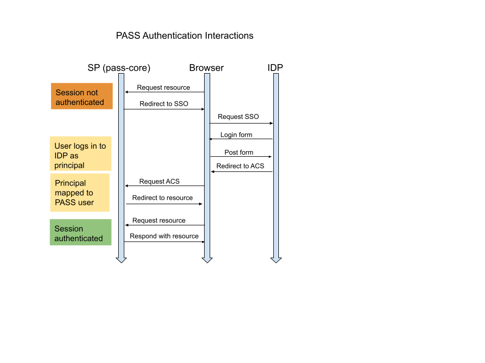

# Authentication and Authorization in Eclipse PASS

## Authentication

### User Interface Authentication

Authentication for the user interface occurs through the use of an authentication service provider (SP), [pass-core](https://github.com/eclipse-pass/pass-core).

`pass-core` is configured to initiate a SAML exchange with a known identity provider (IDP) that supports [Shibboleth](https://shibboleth.atlassian.net/wiki/spaces/CONCEPT/overview). Although `pass-core` itself is not a Shibboleth service provider specifically, it is a generalized SAML service provider that can handle specific Shibboleth interactions with an IDP. In response to a valid `authn` assertion against an IDP, `pass-core` expects to receive and validate a Shibboleth SAML assertion against its assertion consumer service (ACS) URL. This assertion is expected to contain the following Shibboleth attributes:

```
'urn:oid:2.16.840.1.113730.3.1.241': 'Display name'
'urn:oid:1.3.6.1.4.1.5923.1.1.1.9': 'Scoped affiliation'
'urn:oid:0.9.2342.19200300.100.1.3': 'Email'
'urn:oid:2.16.840.1.113730.3.1.3': 'Employee id'
'urn:oid:1.3.6.1.4.1.5923.1.1.1.6': 'eduPersonPrincipalName'
'urn:oid:2.5.4.42': 'Given name'
'urn:oid:2.5.4.4': 'Surname'
'urn:oid:1.3.6.1.4.1.5923.1.1.1.13': 'Unique id'
```

These Shibboleth attributes are used to locate a user in `pass-core` and set up a user object on the session. `pass-core`, establishes a server side session and delivers a http-only cookie to the browser client which [`pass-ui`](https://github.com/eclipse-pass/pass-ui/) will use to establish a client side session in the user interface. This http-only cookie is delivered back to `pass-core` by the user interface with every request. 

This series of interactions is depicted as follows:



### REST API Authentication

Every request to the [REST API](https://github.com/eclipse-pass/pass-core) must be authenticated. If it is not authenticated, it is denied.

Requests to the API come from two types of clients, backend services and users. Requests from users must have already been authenticated with Shibboleth and have the headers specified above. If a request contains Shibboleth headers, it is considered trusted, authentication succeeds, it is associated with a user, and given the SUBMITTER role. If the user does not exist, it is created. If the user does exist, it is updated to reflect the information in the headers. If the request does not contain the Shibboleth headers, it undergoes HTTP basic authentication. There is one HTTP basic user defined with the BACKEND role for the backend services.

Mapping from Shibboleth attributes to PASS users:
  * displayName: Display name 
  * email: Email
  * firstName: Given name
  * lastName: Surname 
  * username: Eppn
  * affiliations:  DOMAIN, all values
  * locatorIds: UNIQUE ID, INSTITUTIONAL_ID, EMPLOYEE_ID
  * role: SUBMITTER

The DOMAIN is the value of the Eppn attribute after `@`.
The UNIQUE_ID is `DOMAIN:unique-id:` joined to the value of the unique id attribute before `@`.
The INSTITUTIONAL_ID is `DOMAIN:eppn` joined to the value of the Eppn attribute before the `@`.
The EMOLOYEE_ID is `DOMAIN:employeeid` joined to the value of the Employe id value.

The locatorIds are used to find an existing user in the system. If any of the locatorIds match an existing user, the user is considered to match.

### Example mapping

Shibboleth attributes:
  * Eppn: sallysubmitter@johnshopkins.edu
  * Display name: Sally M. Submitter
  * Mail: sally232@jhu.edu
  * Given name: Sally
  * Surnamen: Submitter
  * Affiliation: FACULTY@johnshopkins.edu
  * Employee id: 02342342
  * Unique id: sms2323@johnshopkins.edu

Resulting User:
  * affiliation: FACULTY@johnshopkins.edu, johnshopkins.edu
  * displayName: Sally M. Submitter
  * email: sally232@jhu.edu
  * firstName: Sally
  * lastName: Submitter
  * locatorIds: johnshopkins.edu:unique-id:sms2323, johnshopkins.edu:eppn:sallysubmitter, johnshopkins.edu:employeeid:02342342
  * roles: SUBMITTER
  * username: sallysubmitter@johnshopkins.edu

## Authorization

Requests either have a SUBMITTER or BACKEND role. The BACKEND can do everything.
The SUBMITTER is restricted to creating and modifying certain objects in the data model.
The SUBMITTER has full access to all other services.

Object permissions:

| Type    | Create  | Read | Update  | Delete  |
| ------- | ------- | ---- | ------- | ------- |
| Submission | BACKEND or SUBMITTER | any | BACKEND or owns submission | BACKEND or owns submission|
| SubmissionEvent | BACKEND or owns submission | any | BACKEND | BACKEND |
| File | BACKEND or owns submission | any | BACKEND  or owns submission | BACKEND or owns submission|
| Publication | BACKEND or owns submission | any | BACKEND or owns submission | BACKEND or owns submission|
| *       | BACKEND | any  | BACKEND | BACKEND |

The permissions are all role based with the exception of "owns submission". By "owns submission" what is meant is that the user is the submitter or a preparer on a submission associated with the object. A submitter is the target of the submitter relationship on a Submission. A preparer is the target of the preparers relationship on a Submission. SubmissionEvent and File are associated with a submission through a submission relationship. The intent is to make sure submitters can only modify submissions which they have created or are explicitly allowed to help on.
