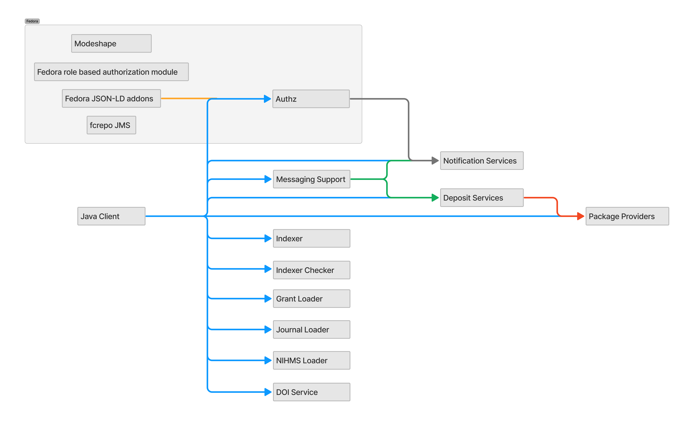

# Components

The PASS application is split between many components.  Below is a summary

| Component | Summary |
| --- | --- |
| [pass-authz](https://github.com/eclipse-pass/pass-authz) | Various authz related components including a user service for dermining the logged in user (included in fcrepo image by pass-docker) and a service for automatically updating the permission on fcrepo objects (authz image in pass-docker) |
| [pass-data-model](https://github.com/eclipse-pass/pass-data-model) | `JSON-LD` [contexts](https://oa-pass.github.io/pass-data-model/src/main/resources/context.jsonld) | URLs need updating to eclipse-pass |
| [pass-ui](https://github.com/eclipse-pass/pass-ui) | The user interface written in Ember |
| [pass-ui-public](https://github.com/eclipse-pass/pass-ui-public) | Holds most of the static assets used by the [pass-ui](https://github.com/eclipse-pass/pass-ui) |
| [pass-ember-adapter](https://github.com/eclipse-pass/pass-ember-adapter) | Adapter for interacting with the Fedora repository |
| [pass-indexer](https://github.com/eclipse-pass/pass-indexer) | The pass-indexer keeps an Elasticsearch index up to date with resources in a Fedora repository.
| [pass-policy-service](https://github.com/eclipse-pass/pass-policy-service) | HTTP API for determining the policies applicable to a given Submission
| [pass-metadata-schemas](https://github.com/eclipse-pass/pass-metadata-schemas) | JSON schemas and example data intended to describe PASS submission metadata
| [pass-download-service](https://github.com/eclipse-pass/pass-download-service) | PASS download service
| [pass-notification-services](https://github.com/eclipse-pass/pass-notification-services) | Notification Services (NS) reacts to SubmissionEvent messages emitted by the Fedora repository by composing and dispatching notifications in the form of emails to the participants related to the event.
| [pass-doi-service](https://github.com/eclipse-pass/pass-doi-service) | Service for accepting a DOI and returning a Journal ID and Crossref metadata for the DOI
| [pass-deposit-services](https://github.com/eclipse-pass/pass-deposit-services) | Deposit Services are responsible for the transfer of custodial content and metadata from end users to repositories. Includes Dockerfile for service.
| [pass-indexer-checker](https://github.com/eclipse-pass/pass-indexer-checker) | A simple check of the indexer before kicking off a push for a loader
| [pass-java-client](https://github.com/eclipse-pass/pass-java-client) | Java library for interacting with PASS data
| [pass-messaging-support](https://github.com/eclipse-pass/pass-messaging-support) | Support library for interacting with fcrepo
| [pass-package-providers](https://github.com/eclipse-pass/pass-package-providers) | Contains support for pass-deposit-services to package deposits for various repositories. Also has Dockerfiles which add provider support by extending pass-deposit-services image. Requires max mvn version 3.6.3 (though seems to depend on the platform) which permits insecure (http) repositories (e.g. http://maven.dataconservancy.org/public/releases/org/dataconservancy/pass/mets-api/1.3.0/mets-api-1.3.0.jar)

There are a few additional project that help support Eclipse PASS but are not
part of the core application.

| Component | Summary |
| --- | --- |
| [pass-docker](https://github.com/eclipse-pass/pass-docker) | The canonical environment for demonstrating integration of the [PASS UI application](https://github.com/eclipse-pass/pass-ui)
| [playground](https://github.com/eclipse-pass/playground) | An collection of small hello-world like applications written in the technologies being used with eclipse-pass so that we can isolate, build, deploy and troubleshoot ops procedures separate from issues with the underlying projects. |
| [pass-dupe-checker](https://github.com/eclipse-pass/pass-dupe-checker) | Traverses a Fedora repository containing PASS resources, and for each resource, determines if a duplicate exists
| [pass-docker-mailserver](https://github.com/eclipse-pass/pass-docker-mailserver) | This fork of docker-mailserver is purpose-built to support integration testing of PASS components

The following application help load data into PASS

| Component | Summary |
| --- | --- |
| [pass-nihms-loader](https://github.com/eclipse-pass/pass-nihms-loader) | The NIHMS Submission ETL contains the components required to download, transform and load Submission information from NIHMS to PASS.
| [pass-grant-loader](https://github.com/eclipse-pass/pass-grant-loader) | This project is comprised of code for retrieving grant data from some kind of data source, and using that data to update the PASS backend.
| [pass-journal-loader](https://github.com/eclipse-pass/pass-journal-loader) |Parses the PMC type A journal .csv file, and/or the medline database .txt file, and syncs with the repository

The following repositories have been forked from others

| Component | Forked From | Notes |
| --- | --- | --- |
| [modeshape](https://github.com/eclipse-pass/modeshape) | [ModeShape](https://github.com/ModeShape/modeshape) | N/A
| [pass-fcrepo-module-auth-rbacl](https://github.com/eclipse-pass/pass-fcrepo-module-auth-rbacl) | [birkland](https://github.com/birkland/fcrepo-module-auth-rbacl) | Role Based Authorization Delegate Module for the Fedora 4 Repository

## Java Project Dependencies

Dependency tree for the Java components in PASS.

