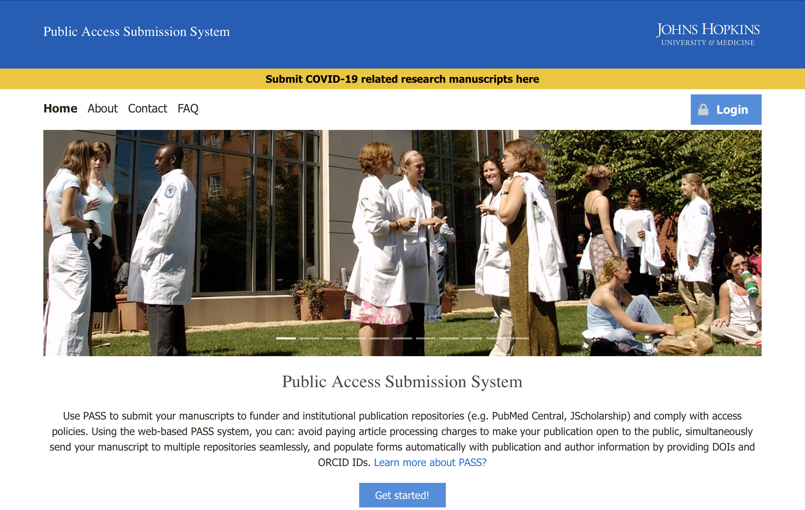
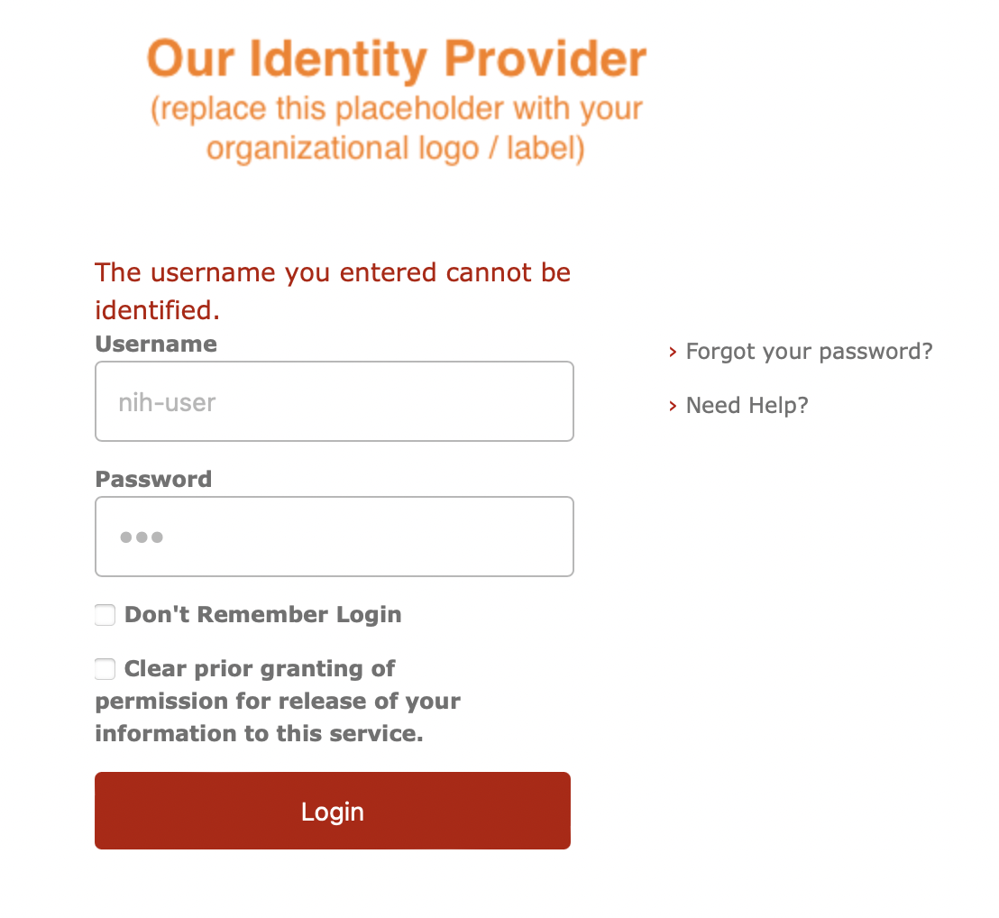
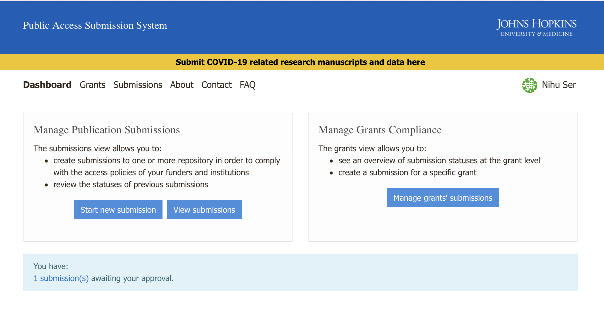

# Setting Up a Local Demo System

## Configure pass.local

You will need edit your local hosts file with

```bash
127.0.0.1 pass.local
```

Instructions to edit the `/etc/hosts` file are avaiable for

* [Windows hosts file](https://www.freecodecamp.org/news/how-to-find-and-edit-a-windows-hosts-file/)
* [Mac/Linux hosts file](https://setapp.com/how-to/edit-mac-hosts-file)

## Install Docker

The demo application runs on [Docker](https://www.docker.com) and [Docker Compose](https://docs.docker.com/compose/).

Installation instructions for Docker and Docker Compose are available for for Windows, Mac and Linux.

* [Docker on Windows](https://docs.docker.com/desktop/install/windows-install/)
* [Docker on Mac](https://docs.docker.com/desktop/install/mac-install/)
* [Docker on Linux](https://docs.docker.com/desktop/install/linux-install/)
* [Docker Compose on all platforms](https://docs.docker.com/compose/install/)

## Download pass-docker

The demo application is available at [pass-docker](https://github.com/eclipse-pass/pass-docker)
You can download a local copy with git

```bash
git clone git@github.com:eclipse-pass/pass-docker.git
```

Don't forget to the `cd` into the new `pass-docker` directory

```bash
cd pass-docker
```

From here you can `git fetch` the latest code and `git checkout <new branch>` to switch between code branches.

There is a helper script [demo.sh](https://github.com/eclipse-pass/pass-docker/blob/main/demo.sh)
that wraps up the `docker-compose` command with the appropriate configuration files, and
you can run any [docker compose cli command](https://docs.docker.com/compose/reference/).


## Pull Latest Docker Images

This will pull all the latest pass docker images.

```bash
./demo.sh pull
```

## Start Pass

This will start pass in the background

```bash
./demo.sh up -d
```

At this point you will need to watch the logs to wait until the
`pass-core` shows that it has started.  This is something we
are actively working to address.

```bash
./demo.sh logs -f
```

It might take a while, but once the logs _stop_ with the message below
then it is ready to load the base data.

```
[main] [Pass, ] INFO  org.eclipse.pass.main.Main.logStarted - Started Main in 69.863 seconds (JVM running for 79.59)
```

That base data can now be loaded using the following command.

```bash
./demo.sh up loader
```

If run successfully it should exit with a message like

```bash
loader  | ### ./data/submissions.json
loader  | Reading file ./data/submissions.json
loader  | Request: [POST] (http://pass-core:8080/data/submission)
loader  | Request: [POST] (http://pass-core:8080/data/submission)
loader  | Request: [POST] (http://pass-core:8080/data/submission)
loader  | Request: [POST] (http://pass-core:8080/data/submission)
loader  |    > Response (http://pass-core:8080/data/submission)
loader  |    > Response (http://pass-core:8080/data/submission)
loader  |    > Response (http://pass-core:8080/data/submission)
loader  |    > Response (http://pass-core:8080/data/submission)
loader exited with code 0
```

## Open browser

In your browser, navigate to [pass.local](https://pass.local).



You can click on login and enter `nih-user` / `moo`.



And then you are authenticated and can view the PASS dashboard.




## Shutting down the demo

The running demo can be stopped with the following command

```bash
./demo.sh down
```

## Troubleshooting

### `WARN[0000]` can be ignored

You might see warnings about unset variables.  That is OK, but also feel free
to push a PR to address the code to no longer display these warnings.

```bash
WARN[0000] The "METADATA_SCHEMA_URI" variable is not set. Defaulting to a blank string.
WARN[0000] The "EMBER_GIT_BRANCH" variable is not set. Defaulting to a blank string.
WARN[0000] The "EMBER_GIT_REPO" variable is not set. Defaulting to a blank string.
```

### Cannot connect to the Docker daemon

If you see error like

```
Cannot connect to the Docker daemon at unix:///var/run/docker.sock. Is the docker daemon running?
```

Then docker is not running (or possibly not installed).  Refer to the `#Install Docker` section
above.

### Cannot find Dockerfile

If you see an error like

```
failed to solve: rpc error: code = Unknown desc = failed to solve with frontend dockerfile.v0: failed to read dockerfile: open /var/lib/docker/tmp/buildkit-mount2714819657/Dockerfile: no such file or directory
```

It's likely pulling all the images did not complete successfully. Re-run 

```bash
./demo.sh pull
```


## References

* [Pass-docker prerequisites](https://github.com/eclipse-pass/pass-docker#prerequisites)


