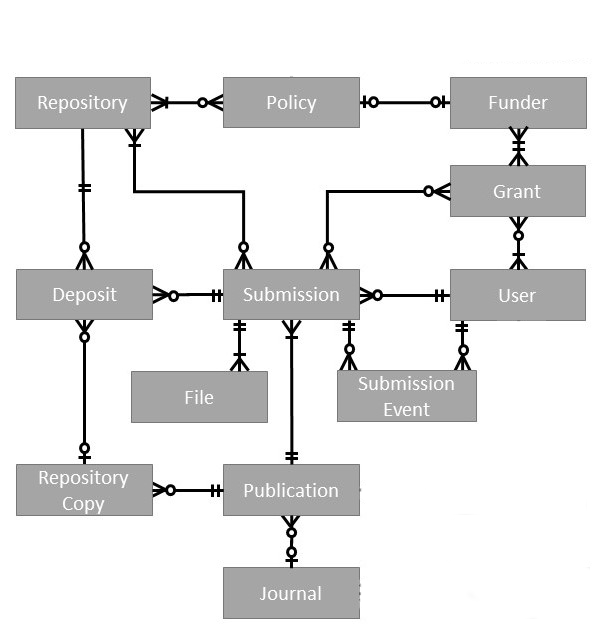

# PASS Data Model

The PASS data model is represented using (JSON API)[https://jsonapi.org/].

In this project you will find
* [Model Objects](#model-objects) - a description of the fields for each object in the model
* [Model Diagram](#model-diagram) - a diagram showing the relationships between each object

## Model Objects
The data model consists of the following components. Each is documented in full on its own page, you can see all of these pages in the [model](/docs/dev/model/) folder.

* [Deposit](Deposit.md)
* [File](File.md)
* [Funder](Funder.md)
* [Grant](Grant.md)
* [Journal](Journal.md)
* [Policy](Policy.md)
* [Publication](Publication.md)
* [Repository](Repository.md)
* [RepositoryCopy](RepositoryCopy.md)
* [Submission](Submission.md)
* [SubmissionEvent](SubmissionEvent.md)
* [User](User.md)

## Model Diagram
 

## Notes

### Identifiers

An object is uniquely identified by a tuple consiting of its id attribute and its type.

### DateTime attributes

DateTime attributes are strings formatted as per the Java DateTimeFormatter with pattern `yyyy-MM-dd'T'HH:mm:ss.SSSX`.
