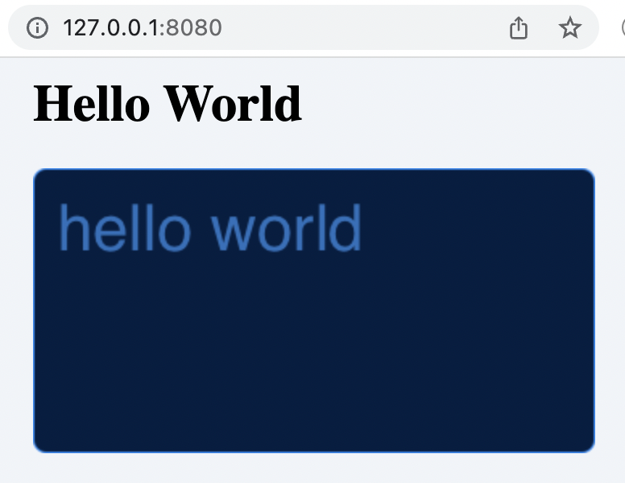
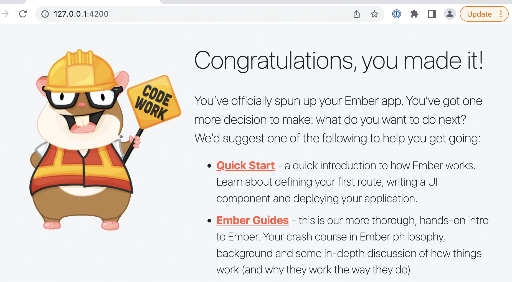

# Playground

A collection of small `hello-world` like applications written
in the technologies being used with eclipse-pass so that we can
isolate, build, deploy and troubleshoot ops procedures separate
from issues with the underlying projects.

## HTML Application (Via Docker)

The [html-app](https://github.com/eclipse-pass/playground/tree/main/html-app) is a bare-bones HTML website
that is launched through docker (internally running nginx).
This aligns with [pass-offline-docker](https://github.com/OA-PASS/pass-offline-docker)
as a site that `hosts a single HTML file that displays that PASS is offline.`

To build the application locally you will need [Docker Deskop](https://www.docker.com/products/developer-tools/)

```bash
cd html-app && \
  docker build -t html-app .
```

To launch a build container, run

```bash
docker run -p 8080:80 html-app
```

And then you can visit http://127.0.0.1:8080



## EmberJS Application

The [emberjs-app](https://github.com/eclipse-pass/playground/tree/main/emberjs-app)
is a hello-world web app using [EmberJS](https://emberjs.com/).

### Requirments

This requires `node`, `npm` and `emberjs` and can be installed with [homebrew](https://brew.sh) on a mac.

```bash
brew install node
npm install -g ember-cli
```

The application itself was built by running

```bash
ember new emberjs-app --lang en
```

### Running (Via Docker)

The application can also be run via Docker.

To build the application locally you will need [Docker Deskop](https://www.docker.com/products/developer-tools/)

```bash
cd emberjs-app && \
  docker build -t emberjs-app .
```

To launch a build container, run

```bash
docker run -p 8080:80 emberjs-app
```

And then you can visit http://127.0.0.1:8080

#### Troubleshooting Docker

To troubleshoot the container, run

```bash
docker run -p 8080:80 -it --entrypoint sh emberjs-app
```

### Running (bare metal)

To launch the emberjs-app, run the following

```bash
cd emberjs-app && \
  ember serve
````

The output should look similar to

```bash
Build successful (4818ms) – Serving on http://localhost:4200/

Slowest Nodes (totalTime >= 5%)               | Total (avg)
----------------------------------------------+------------
Babel: @ember/test-helpers (1)                | 1134ms
ember-auto-import-webpack (1)                 | 687ms
BroccoliRollup (6)                            | 396ms (66 ms)
Rollup (2)                                    | 378ms (189 ms)
Babel: @ember-data/store (2)                  | 279ms (139 ms)
```

And then you can visit http://127.0.0.1:4200



### Testing the application

To run the tests, run the following

```bash
cd emberjs-app && \
  ember test
```

The results should look like the following

```bash
Environment: test
cleaning up...
Built project successfully. Stored in "/var/folders/0_/c1nz9syd7svd18qms5rf1_1h0000gn/T/tests-dist-2022411-68622-1286wzc.cayu".
ok 1 Chrome 101.0 - [1 ms] - ember-qunit: Ember.onerror validation: Ember.onerror is functioning properly

1..1
# tests 1
# pass  1
# skip  0
# todo  0
# fail  0

# ok
```

## Maven JAR

The [maven-jar](https://github.com/eclipse-pass/playground/tree/main/maven-jar) is a bare-bones Java executable (jar)
This aligns with [deposit-services](https://github.com/OA-PASS/deposit-services)
as `Deposit Services' primary artifact is a single self-executing jar.`

To build the application locally you will need

* [Maven](https://maven.apache.org/install.html), installabl with `brew install maven`
* [Java](https://openjdk.java.net)

### Compile the application

To build the application

```bash
cd maven-jav && \
  mvn clean install
```

### Skip Tests

```bash
cd maven-jav && \
  mvn clean package -DskipTests
```

### Run Tests


```bash
cd maven-jav && \
  mvn clean test
```

The output should look similar to

```bash
[INFO] Scanning for projects...
[INFO]
[INFO] -----------------------< eclipse-pass:maven-jar >-----------------------
[INFO] Building MavenJar 0.1.0
[INFO] --------------------------------[ jar ]---------------------------------
[INFO]
[INFO] --- maven-clean-plugin:2.5:clean (default-clean) @ maven-jar ---
[INFO] Deleting /Users/aforward/sin/projects/pass-eclipse/playground/maven-jar/target
....
[INFO] --- maven-install-plugin:2.4:install (default-install) @ maven-jar ---
[INFO] Installing /Users/aforward/sin/projects/pass-eclipse/playground/maven-jar/target/maven-jar-0.1.0.jar to /Users/aforward/.m2/repository/eclipse-pass/maven-jar/0.1.0/maven-jar-0.1.0.jar
[INFO] Installing /Users/aforward/sin/projects/pass-eclipse/playground/maven-jar/pom.xml to /Users/aforward/.m2/repository/eclipse-pass/maven-jar/0.1.0/maven-jar-0.1.0.pom
[INFO] ------------------------------------------------------------------------
[INFO] BUILD SUCCESS
[INFO] ------------------------------------------------------------------------
[INFO] Total time:  1.736 s
[INFO] Finished at: 2022-03-31T13:38:15-04:00
[INFO] ------------------------------------------------------------------------
```

### Running the application

With the JAR built, you can run the application as follows

```bash
java -jar ./target/maven-jar-0.1.0.jar
```

And the output should look like

```bash
Welcome to a maven executable
```


## Maven Service

The [maven-service](https://github.com/eclipse-pass/playground/tree/main/maven-service) is a bare-bones Java service (
as an executable jar).  This project also aligns with the
[deposit-services](https://github.com/OA-PASS/deposit-services)
with an additional _feature_.  The application will run forever
(until explicitly stopped), whereas the maven jar will _complete_
its task within a finite timeframe and then stop executing.

To build the application locally you will need

* [Maven](https://maven.apache.org/install.html), installabl with `brew install maven`
* [Java](https://openjdk.java.net)

Similar mechanism to build and test as [maven-jav](https://github.com/eclipse-pass/playground/tree/main/maven-jav) project.  This
service will run forever.

### Running the application

```bash
java -jar ./target/maven-service-0.1.0.jar
```

The application will continue to execute until you hit "Enter".

```
Welcome to a maven service
Press Enter to stop server

```
