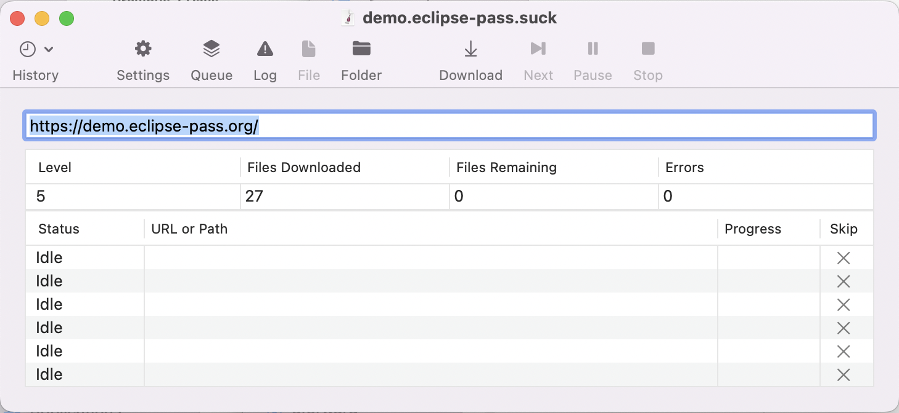
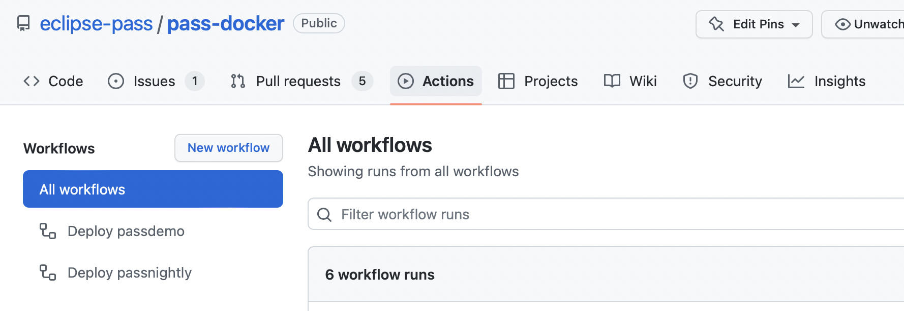
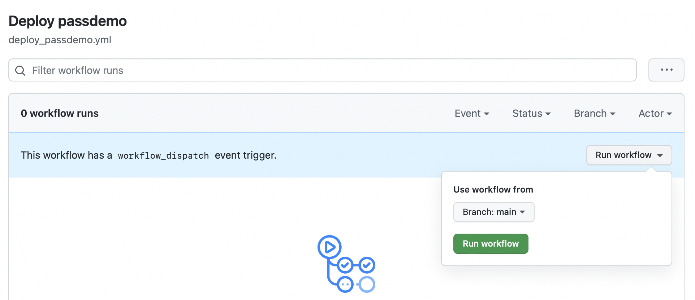
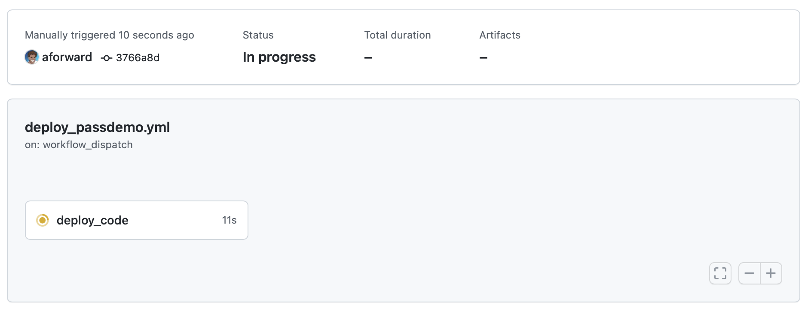

# Eclipse Foundation Operations

The following site are managed by the Eclipse Foundation.

| URL | Notes | Status
| --- | --- | --- |
| eclipse-pass.org | Github Pages HTML / CSS | running-locally (DNS not configured)
| demo.eclipse-pass.org | GitHub Self-Hosted Runner / Docker Compose | running
| nightly.eclipse-pass.org | GitHub Self-Hosted Runner / Docker Compose | running-locally (DNS not configured)

The underlying infrastructure for each is documented here

| Infra | User | Details
| --- | --- | --- |
| Github Pages HTML / CSS | N/A | [Automatic via GitHub Actions](https://pages.github.com)
| GitHub Self-Hosted Runner / Docker Compose | githubrunner | Run from /opt/githubrunner/pass-docker/pass-docker/pass-docker

If you are looking for more detailed developer-oriented instructions
to help debug an issue with the above, please refer to
[managing our demo servers](deploy_demo.md) documentation.

## Configurations

The [.eclipsefdn](https://github.com/eclipse-pass/.eclipsefdn) project allows our team to
[self-service several aspect of our organization](https://www.eclipse.org/projects/handbook/#resources-github-self-service)
via a tool called [Otterdog](/docs/infra/otterdog.md) and secrets in [Bitwarden](/docs/infra/bitwarden.md).

These [.eclipsefdn](https://github.com/eclipse-pass/.eclipsefdn) repo / tools gives access to:

* Organization Settings
* Organization Webhooks
* Repositories and their settings
* Branch Protection Rules

Learn more about [Otterdog here](/docs/infra/otterdog.md).


## Deployment

### eclipse-pass.org

This is managed with [GitHub Pages](https://pages.github.com)
from the [eclipse-pass.github.io](https://github.com/eclipse-pass/eclipse-pass.github.io) repo.

#### Sync Demo To Marketing

The [demo.eclipse-pass.org](https://demo.eclipse-pass.org) site includes marketing
information about PASS that we currently synchronize with the main [eclipse-pass.org](https://pages.github.com) site.

1. Download the publicly accessible site.

This can be done with a tool like [SiteSucker](https://apps.apple.com/us/app/sitesucker/id442168834) on a Mac.



2. Update the [eclipse-pass.github.io](https://github.com/eclipse-pass/eclipse-pass.github.io) repo.

In a new branch, copy all files from the download site.

3. Fix references to the demo site

Any link to "idp" for login purposes, such as

```html
<a href="idp/..." class="btn btn-primary my-3 pl-4 pr-4 ember-view">Use the Demo</a>
```

Should be updated to

```html
<a href="https://demo.eclipse-pass.org/login/jhu" class="btn btn-primary my-3 pl-4 pr-4 ember-view">Use the Demo</a>
```

3. PR branch into main

Once the code is in main, the site will automatically be deployed to [eclipse-pass.org](https://eclipse-pass.org).


### demo.eclipse-pass.org

The [demo.eclipse-pass.org](https://demo.eclipse-pass.org) site is deployed
on demand using [GitHub actions](https://github.com/features/actions).
Note that this site is not yet publically available.

The demo system is based on the [pass-docker](https://github.com/eclipse-pass/pass-docker) project
and you can view the available [actions](https://github.com/eclipse-pass/pass-docker/actions)
including the [Deploy passdemo action](https://github.com/eclipse-pass/pass-docker/blob/main/.github/workflows/deploy_passdemo.yml)

#### Publish Via GitHub.com

To publish an update, access the actions page.



You can then [run the workflow](https://github.com/eclipse-pass/pass-docker/actions/workflows/deploy_passdemo.yml)



And watch the deploy.



#### Locally Run Via Docker Compose

The [demo.eclipse-pass.org](https://demo.eclipse-pass.org) site is
managed using [Docker Compose](https://docs.docker.com/compose/).

To run locally first get a local copy of [pass-docker](https://github.com/eclipse-pass/pass-docker)
then run it with the following commands

```
cd pass-docker && \
  docker-compose -f eclipse-pass.base.yml -f eclipse-pass.demo.yml pull && \
  docker-compose -f eclipse-pass.base.yml -f eclipse-pass.demo.yml up
```

For more information debugging the deployment to our demo servers
please refer to our [demo deploy documentation](deploy_demo.md).

### nightly.eclipse-pass.org

The [nightly.eclipse-pass.org](https://demo.eclipse-pass.org) site is deployed
automatically on PR merged (as well as nightly) using [GitHub actions](https://github.com/features/actions).
Note that this site is not yet publically available.

Much like [demo.eclipse-pass.org](https://demo.eclipse-pass.org) the nightly
system is based on the [pass-docker](https://github.com/eclipse-pass/pass-docker) project
and you can view the available [actions](https://github.com/eclipse-pass/pass-docker/actions)
including the [Deploy passdemo action](https://github.com/eclipse-pass/pass-docker/blob/main/.github/workflows/deploy_passdemo.yml)

#### Locally Run Via Docker Compose

The [nightly.eclipse-pass.org](https://nightly.eclipse-pass.org) site is
managed using [Docker Compose](https://docs.docker.com/compose/).

To run locally first get a local copy of [pass-docker](https://github.com/eclipse-pass/pass-docker)
then run it with the following commands

```
cd pass-docker && \
  docker-compose -f eclipse-pass.base.yml -f eclipse-pass.nightly.yml pull && \
  docker-compose -f eclipse-pass.base.yml -f eclipse-pass.nightly.yml up
```

For more information debugging the deployment to our demo servers
(such as [nightly.eclipse-pass.org](https://nightly.eclipse-pass.org))
please refer to our [demo deploy documentation](deploy_demo.md).


## Infrastructure

A bootstrapped server [installer](/tools/eclipse_ops/bootstrap)
to run a stand-alone PASS application via the [pass-docker](https://github.com/eclipse-pass/pass-docker)
project

Which will do the following

* Install docker
* Install [github self-hosted runners](self_hosted_github_runners.md)
* Intall [pass-docker](https://github.com/eclipse-pass/pass-docker)
* Configure [pass docker for a GH runner](self_hosted_github_runners.md)

To configure the self-hosted runner you will need the GITHUB token,
replacing the `XXX` with the actual token value.

```
GITHUB_RUNNER_TOKEN=XXX
```

Learn more from the [installer script itself](/tools/eclipse_ops/bootstrap).

## Run PASS

To manually run the application, execute

```bash
cd /src/pass-docker && \
  sudo docker-compose pull && \
  sudo docker-compose up
```

If you want to run in the background then use `-d`.

```bash
sudo docker-compose up -d
```

## Troubleshooting

### Access Eclipse Servers

To access the Eclipse infrastructure you will need a `bastion.eclipse.org` login.
If you do not have a `bastion` login, then you will need to reach out to
a [team member](https://github.com/orgs/eclipse-pass/teams/technology-pass-committers/members)
for instructions (and permission) to get such a login.

| Server | IP |
| --- | --- |
| nightly.eclipse-pass.org | `ssh ${ME}@bastion.eclipse.org -t ssh ${ME}@172.30.206.14`
| demo.eclipse-pass.org | `ssh ${ME}@bastion.eclipse.org -t ssh ${ME}@172.30.206.15`

You will need to change `ME` to your username

```bash
ME=myusername
```

Once on the server, then CD into the directory and change to the `githubrunner` user

```bash
cd /opt/githubrunner/pass-docker/pass-docker/pass-docker
sudo su githubrunner
```

Now you have full access to the application and can run the application as shown below

### Run Remote Apps

From our [GitHub actions](https://github.com/features/actions) you will see
the specifics on running the servers

| Server | Configs | Runner |
| --- | --- | --- |
| nightly.eclipse-pass.org | `docker-compose -f eclipse-pass.base.yml -f eclipse-pass.nightly.yml` | [nightly script](https://github.com/eclipse-pass/pass-docker/blob/main/.github/workflows/deploy_passnightly.yml)
| demo.eclipse-pass.org | `docker-compose -f eclipse-pass.base.yml -f eclipse-pass.demo.yml`  | [demo script](https://github.com/eclipse-pass/pass-docker/blob/main/.github/workflows/deploy_passdemo.yml)

For example, to stop all `demo` services run,

```
docker-compose -f eclipse-pass.base.yml -f eclipse-pass.demo.yml down
```

### Remove Rogue Processes

If the docker-compose file has drastically changed, then there migth be _rogue_ processes
still running.  You can view them with

```bash
docker ps
```

Then grab the container IDs and manually stop them.

```bash
docker stop 03159019094f
```
