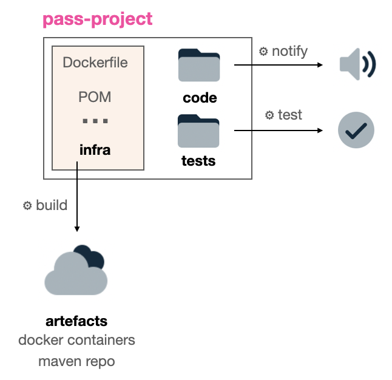

# PASS Pipeline

## Orchestration

Below is an outline of how the various pieces of the PASS infrastructure will be coordinated into a release.
We will start with non-production-ready version using [pass-docker](https://github.com/eclipse-pass/pass-docker) and in particular one
based on [GitHub Actions via Self-Hosted Runner](https://github.com/eclipse-pass/pass-docker/tree/178-docker-compose-gh-actions).

Once branch `178-docker-compose-gh-actions` is merged, this documentation should be updated to
point back to the `main` branch.

As different environments (cd, nightly, dev, demo, pre-production, production) are
introduced this documentation will be updated to reflect those differences (for
example cd, nightly, dev, demo will all use a _fake_ nihms FTP server).

The [docker containers should be migrated based on eclipse-pass dependencies](../dev/integration-test-docker-dependencies.md).

### Application Reposibilities

The PASS application will be responsible for

* Building core artefacts (e.g. customizations to the fedora images)
* Updating environment manifests (e.g a new container image to upgrade the deposit service)
* Deoploying to a setup environment (based on the manifest)

Note that the `pass-app` currently refers to the [pass-docker repo](https://github.com/eclipse-pass/pass-docker).
The recommendation is that `pass-docker` be renamed (and enhanced) to
capture using [infrastructure as code](https://en.wikipedia.org/wiki/Infrastructure_as_code)) all configurable environments.

Here is a summary of the actions and their current triggers / implementation status (note not all _actions_ have been fully automated).

| Action | Trigger | Note
| --- | --- | --- |
| deploy_demo | GH Action Button | In development
| update_core_versions | Manual | Manually build / publish containers, update pass-docker manifests
| update_datastores | Manual | Same as `update_core_versions`
| update_project | Manual | Update pass-docker manifests

### Project Reposibilities

The individual projects will be responsible for

* Running automated quality control (aka unit and integration tests)
* Building project artefacts (e.g. Java JARs, Docker images, Golang binaries)
* Notifying the application of the update

The artefacts will be stored in a consistent manner so the application
can correct grab the appropriate versions when orchestrating a release.

| Action | Trigger | Note
| --- | --- | --- |
| test | GH PRs | Mostly in place for all projects
| build | Manual | Working towards GH actions
| notify | Manual | Notify via email/slack/carrier pigeon of update

## Artefact Decomposition

The PASS project can be viewed as a decomposition of

* core infrastrcture (e.g. database, web servers, indexes)
* access to third party data stores (e.g. DSpace, Nihms)
* identify management (e.g. login, authentication, authorization)
* PASS projects (e.g. ui, deposit services, loaders)

Each decomposition will have different levels of automation and
different release cycles.

### Core Infrastructure

The following core pieces of infrastructure are required for the PASS Application.
These pieces are more stable and will not be updated frequently.

| Name | Based On | Notes |
| --- | --- | --- |
| fcrepo | [tomcat:8.5.40-jre8-alpine docker](https://github.com/eclipse-pass/pass-docker/blob/178-docker-compose-gh-actions/fcrepo/4.7.5/Dockerfile) | Old version (4.7.5) and relies heavily on `OAPASS` instead of `eclipse-pass`
| postgres | [postgres:10.3-alpine docker](https://github.com/eclipse-pass/pass-docker/blob/178-docker-compose-gh-actions/postgres/10.3/Dockerfile) | Underlying DB for fcrepo
| activemq | [openjdk:8-jre-alpine docker](https://github.com/eclipse-pass/pass-docker/blob/178-docker-compose-gh-actions/activemq/Dockerfile) | Version 5.15.11
| httpd-proxy | [centos docker](https://github.com/eclipse-pass/pass-docker/blob/178-docker-compose-gh-actions/httpd-proxy/Dockerfile) | Orchestration between services
| elasticsearch | [elasticsearch/elasticsearch-oss 6.2.3 docker](https://www.docker.elastic.co/r/elasticsearch/elasticsearch-oss) | [Security vulnerability to patch](https://github.com/eclipse-pass/main/issues/274)
| mail | oapass/docker-mailserver | Should be updated to [eclipse-pass/pass-docker-mailserver](https://github.com/eclipse-pass/pass-docker-mailserver/blob/main/Dockerfile)

### Third Party Data Stores

The following third party data stores are configured / configurable within PASS.
These pieces are more stable and will not be updated frequently.

| Name | Based On | Notes |
| --- | --- | --- |
| nihms ftpserver | [stilliard/pure-ftpd docker](https://github.com/eclipse-pass/pass-docker/blob/178-docker-compose-gh-actions/ftpserver/0.0.1-demo/Dockerfile) | Sample [Nimhs FTP Server](https://www.nihms.nih.gov/login/?next=/submission/)
| dspace | [jetty:9.4.7-jre8-alpine docker](https://github.com/eclipse-pass/pass-docker/blob/178-docker-compose-gh-actions/dspace/6.2/Dockerfile) | Sample [DSpace database](https://www.dspace.com/en/inc/home.cfm)

### Identity Management

The following core pieces manage authentication.
These pieces are more stable and will not be updated frequently.

| Name | Based On | Notes |
| --- | --- | --- |
| idp | [unicon/shibboleth-idp docker](https://github.com/eclipse-pass/pass-docker/blob/178-docker-compose-gh-actions/idp/Dockerfile) | Based on shibboleth and configurable for common, harvard and jhu
| ldap | [centos docker](https://github.com/eclipse-pass/pass-docker/blob/178-docker-compose-gh-actions/ldap/Dockerfile) | Configured for fakek accounts on common, harvard and jhu
| shibboleth-sp | [unicon/shibboleth-sp docker](https://github.com/eclipse-pass/pass-docker/blob/178-docker-compose-gh-actions/sp/2.6.1/Dockerfile) | Core shibboleth service provider
| authz | [openjdk:8u212-jre-alpine3.9 docker](https://github.com/eclipse-pass/pass-docker/blob/178-docker-compose-gh-actions/authz/Dockerfile) | Managed via `oapass.org`

### PASS Projects

The following projects will manage building their own containers.

| Name | Installation | Notes |
| --- | --- | --- |
| pass-ui | [docker](https://github.com/eclipse-pass/pass-docker/blob/178-docker-compose-gh-actions/ember/Dockerfile) | Relies on `OA-PASS/pass-ember` and should be updated to `eclipse-pass/pass-ui`
| pass-ui-static | [docker](https://github.com/eclipse-pass/pass-docker/blob/178-docker-compose-gh-actions/static-html/Dockerfile) | Relies on `OA-PASS` should be updated to `eclipse-pass`
| indexer | [openjdk:8u212-jre-alpine3.9 docker](https://github.com/eclipse-pass/pass-docker/blob/178-docker-compose-gh-actions/indexer/0.0.18-SNAPSHOT/Dockerfile) | Relies on `OA-PASS` should be updated to `eclipse-pass`
| assets | [alpine:3.7](https://github.com/eclipse-pass/pass-docker/blob/178-docker-compose-gh-actions/assets/Dockerfile) | Based on [minimal assets data.tar](https://github.com/eclipse-pass/pass-docker/blob/178-docker-compose-gh-actions/assets/data.tar) within [pass-docker](https://github.com/eclipse-pass/pass-docker)
| deposit-services | [pass-package-providers docker](https://github.com/eclipse-pass/pass-package-providers) | Based on `oapass/deposit-services-providers` and should be moved to `eclipse-pass/pass-package-providers` Configurable for [JHU](https://github.com/eclipse-pass/pass-docker/blob/178-docker-compose-gh-actions/deposit-services/repositories-jhu.json) or [Harvard](https://github.com/eclipse-pass/pass-docker/blob/178-docker-compose-gh-actions/deposit-services/repositories-harvard.json)
| notification-services | notification-services/0.1.0-3.4 | Update to to [eclipse-pass/pass-notification-services](https://github.com/eclipse-pass/pass-notification-services)
| schemaservice | oapass/schema-service:v0.6.1-3 | Update to [eclipse-pass/pass-metadata-schemas](https://github.com/eclipse-pass/pass-metadata-schemas)
| policyservice | oapass/policy-service:v0.1.2 | Update to [eclipse-pass/pass-policy-service](https://github.com/eclipse-pass/pass-policy-service)
| doiservice | oapass/doi-service:version1.0.0 | Update to [eclipse-pass/pass-doi-service](https://github.com/eclipse-pass/pass-doi-service)
| downloadservice | oapass/download-service:v1.0.2 | Update to [eclipse-pass/pass-download-service](https://github.com/eclipse-pass/pass-download-service)

## Component CI/CD Capabilities

The table below will document the progression from source code commits to
a production running application for the many [PASS components](../dev#components).

| Project | Build | UTs |ITs | Deploy |
| --- | --- | --- | --- | --- |
| [pass-authz](https://github.com/eclipse-pass/pass-authz) | ✅ | ✅ | ✅ | ❓ |
| [pass-data-model](https://github.com/eclipse-pass/pass-data-model) | ❌ | ❌ | ❌ | ❓ |
| [pass-ui](https://github.com/eclipse-pass/pass-ui) | ✅ | ✅ | ❌ | ❓ |
| [pass-ui-public](https://github.com/eclipse-pass/pass-ui-public) | ❌ | ❌ | ❌ | ❓ |
| [pass-ember-adapter](https://github.com/eclipse-pass/pass-ember-adapter) | ✅ | ✅ | ❎ | ❓ |
| [pass-indexer](https://github.com/eclipse-pass/pass-indexer) | ✅ | ✅ | ✅ | ❓ |
| [pass-policy-service](https://github.com/eclipse-pass/pass-policy-service) | ✅ | ✅ | ✅ | ❓ |
| [pass-metadata-schemas](https://github.com/eclipse-pass/pass-metadata-schemas) | ✅ | ✅ | ❌ | ❓ |
| [pass-download-service](https://github.com/eclipse-pass/pass-download-service) | ✅ | ❌ | ❎ | ❓ |
| [pass-notification-services](https://github.com/eclipse-pass/pass-notification-services) | ✅ | ✅ | ✅ | ❓ |
| [pass-doi-service](https://github.com/eclipse-pass/pass-doi-service) | ✅ | ✅ | ❎ | ❓ |
| [pass-deposit-services](https://github.com/eclipse-pass/pass-deposit-services) | ✅ | ✅ | ✅ | ❓ |
| [pass-indexer-checker](https://github.com/eclipse-pass/pass-indexer-checker) | ✅ | ✅ | ✅ | ❓ |
| [pass-java-client](https://github.com/eclipse-pass/pass-java-client) | ✅ | ✅ | ✅ | ❓ |
| [pass-messaging-support](https://github.com/eclipse-pass/pass-messaging-support) | ✅ | ✅ | ✅ | ❓ |
| [pass-package-providers](https://github.com/eclipse-pass/pass-package-providers) | ✅ | ✅ | ✅ | ❓ |

There are a few additional project that help support Eclipse PASS but are not
part of the core application.

| Project | Build | UTs |ITs | Deploy |
| --- | --- | --- | --- | --- |
| [pass-docker](https://github.com/eclipse-pass/pass-docker) | ❌ | ❌ | ❌ | ❓ |
| [playground](https://github.com/eclipse-pass/playground) | ❌ | ❌ | ❌ | ❓ |
| [pass-dupe-checker](https://github.com/eclipse-pass/pass-dupe-checker) | ✅ | ✅ | ❌ | ❓ |
| [pass-docker-mailserver](https://github.com/eclipse-pass/pass-docker-mailserver) | ❎ | ❌ | ❌ | ❓ |

The following application help load data into PASS

| Project | Build | UTs |ITs | Deploy |
| --- | --- | --- | --- | --- |
| [pass-nihms-loader](https://github.com/eclipse-pass/pass-nihms-loader) | ✅ | ✅ | ✅ | ❓ |
| [pass-grant-loader](https://github.com/eclipse-pass/pass-grant-loader) | ✅ | ✅ | ✅ | ❓ |
| [pass-journal-loader](https://github.com/eclipse-pass/pass-journal-loader) | ✅ | ✅ | ✅ | ❓ |

The following repositories have been forked from others

| Project | Forked From |
| --- | --- |
| [modeshape](https://github.com/eclipse-pass/modeshape) | [ModeShape](https://github.com/ModeShape/modeshape) |
| [pass-fcrepo-module-auth-rbacl](https://github.com/eclipse-pass/pass-fcrepo-module-auth-rbacl) | [birkland](https://github.com/birkland/fcrepo-module-auth-rbacl) |

## Unit Testing

| Project | Command | Dependencies |
| --- | --- | --- |
| pass-ember-adapter | export FEDORA_ADAPTER_INTEGRATION_TEST=0 yarn install ember test | Ember.js Ember
| pass-ui | npm config set spin false yarn install ember test --test-port=4200 | NPM, Yarn, Ember.js
| pass-deposit-services | mvn test | Maven, Java
| pass-authz | mvn -pl -pass-authz-integration test | Maven, Java 8
| pass-java-client |  mvn test -DskipITs=true | Java, mvn test works if mvn package run first.
| pass-indexer | mvn test -DskipITs=true | Java
| pass-policy-service | go test ./... | Go
| pass-metadata-schemas | go test ./... | Go
| pass-download-service | go test ./... | Go
| pass-notification-services | mvn test | Java 8
| pass-doi-service | mvn test | Java
| pass-indexer-checker | mvn test | Java
| pass-dupe-checker | go test | Go
| pass-package-providers | mvn test | Java, Mvn 3.6.3 (depending on platform, later release might work)
| pass-messaging-support | mvn test | Java
| pass-nihms-loader | mvn test | Java
| pass-grant-loader | mvn test | Java
| pass-journal-loader | mvn test | Java
| pass-fcrepo-module-auth-rbacl | mvn test | Java 8, Mvn 3.6.3 (depending on platform, later release might work)

## Integration Testing

| Project | Command | Dependencies |
| --- | --- | --- |
| pass-ember-adapter | docker-compose up -d yarn install ember test | Ember.js Ember Docker
| pass-deposit-services | mvn verify | Maven, Java, Docker
| pass-authz | mvn verify | Maven, Java 8, Docker
| pass-java-client | mvn verify | Java, Docker, mvn verify works if mvn package run first.
| pass-indexer | docker-compose up -d mvn verify | Java, Docker
| pass-policy-service | docker-compose up -d go test -tags=integration ./... | Go
| pass-download-service | docker-compose up -d go test -tags=integration ./... | Go
| pass-notification-services | mvn verify | Java 8, Docker
| pass-doi-service | mvn verify | Java, Docker
| pass-indexer-checker | mvn verify | Java, Docker
| pass-package-providers | mvn verify | Java, Docker, Mvn 3.6.3 (depending on platform, later release might work)
| pass-messaging-support | mvn verify | Java, Docker
| pass-nihms-loader | mvn verify | Java, Docker
| pass-grant-loader | mvn verify | Java, Docker
| pass-journal-loader | mvn verify | Java, Docker
| pass-fcrepo-module-auth-rbacl | mvn test | Java 8, Mvn 3.6.3 (depending on platform, later release might work)

## Building

| Project | Command | Dependencies |
| --- | --- | --- |
| pass-ember-adapter | yarn install ember build | Ember.js Ember
| pass-ui | yarn install ember build | Ember.js Ember
| pass-deposit-services | mvn install | Maven, Java, Docker
| pass-authz | mvn install | Maven, Java 8, Docker
| pass-java-client | mvn install | Java, Docker
| pass-indexer | docker-compose up -d mvn install | Java, Docker
| pass-policy-service | go generate ./... go build ./cmd/pass-policy-service | Go
| pass-docker-mailserver | docker build -t oapass/docker-mailserver:DATE . | Docker
| pass-metadata-schemas | go build ./cmd/pass-schema-service | Go
| pass-download-service | go build | Go
| pass-notification-services | mvn install | Java, Docker
| pass-doi-service | mvn install | Java, Docker
| pass-indexer-checker | mvn install | Java, Docker
| pass-dupe-checker | go build | Go
| pass-package-providers | mvn install | Java, Docker
| pass-messaging-support | mvn install | Java, Docker
| pass-nihms-loader | mvn install | Java, Docker
| pass-grant-loader | mvn install | Java, Docker
| pass-journal-loader | mvn install | Java, Docker

## Dependencies

| Element | Current Version | Latest Version | Notes
| --- | --- | --- | --- |
| Go | 1.12 | [1.18](https://go.dev/dl/) | Programming language
| Java | 17 | [22](https://www.java.com/releases/) | Programming language
| Fedora | 4.7.5 | [6.1.1](https://github.com/fcrepo/fcrepo/releases) | Document store (database) for PASS
| Postgres | 13.3 | [14.2](https://www.postgresql.org/docs/release/) | Underlying storage of Fedora
| Node | 14.x | [18.x](https://nodejs.org/en/about/releases/) | JavaScript runtime, unconfirmed on desired version
| Npm | 6.14.x | [6.14.8](https://github.com/npm/npm/releases) | Package manager for node |
| Maven | 3.6.3 | [3.8.5](https://maven.apache.org/docs/history.html) | Java Package manager
| ElasticSearch| 7.13.3 | [8.1.3](https://github.com/elastic/elasticsearch/releases) | Search / indexing
| Shibboleth | 2 | [3.3.0](https://shibboleth.atlassian.net/wiki/spaces/SP3/pages/2065335693/ReleaseNotes) | Authentication
| Ember.js | 3.8 | [3.28.8](https://github.com/emberjs/ember.js/releases) | The user interface
| Ember CLI | 2.13 | [4.3.0](https://github.com/ember-cli/ember-cli/releases) | CLI for managing an ember application |
| Docker Compose | 1.29.2 | [2.5.0](https://github.com/docker/compose/releases) | CLI for managing docker containers |

## References

* [Deploying pass-docker via EC2](ec2.md)
* [Deploying pass-docker via Digital Ocean](digitalocean.md)
* [Deploying pass-docker via Eclipse Foundation (EF)](eclipseops.md)
* [Our attempt to use Komposer to migrate Docker Compose to k8s manifest](docker-composer-to-k8s-manifest.md)
* [Travis configs for pass-ui](https://travis-ci.org/github/OA-PASS/pass-ember/jobs/770188235/config)
* [Coveralls for pass-ui (pass-ember URL no longer valid)](https://coveralls.io/)
